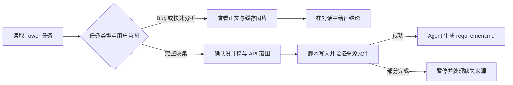

# SpecWeaver

macOS 桌面控制台。在 Claude Code、Codex、Cursor 三个宿主之间开关 SpecWeaver 的
MCP 与 Skills，并集中配置 Tower、蓝湖、Eolink 的认证，不用再手工去改各宿主的配置文件。

> 面向公司内部同事。MCP 和 Skills 都是按公司产品定制的，外部拿到也用不了。

## 能做什么

SpecWeaver 把散落在需求任务、设计稿和 API 文档里的事实收集到项目，再交给 Agent
分析或开发。它提供三类来源能力和三项独立工作能力：

- **需求**：读取 Tower 正文、独立评论、子任务和图片；Bug 可直接快速分析，普通需求可
  完整收集资料并生成 `requirement.md`。
- **设计稿**：读取蓝湖候选、预览图、图层结构和真实切图，既能参与完整需求收集，也能
  单独核对或在开发时还原界面。
- **API 文档**：读取 Eolink 接口、请求参数、响应字段、枚举和示例，既能参与完整需求
  收集，也能单独核对接口契约。
- **Git 提交**：审查明确范围、运行必要验证并生成受控提交；有关联 Tower 时，评论始终
  先预览，确认后才发布。
- **日报**：只在明确要求时记录已经完成的代码工作，并按天汇总多个项目。
- **合并**：在确认后推送当前分支，通过 `sw merge` 合并到测试分支并追踪对应流水线；
  主干合并始终留给人工审核。

## 需求工作流

SpecWeaver 把“确定性收集”和“需求分析”分开：MCP 负责读取、下载、命名、写入和验证，
Agent 负责理解业务规则、识别冲突与缺失。相同来源和范围产生的来源文件不依赖模型发挥。



完整收集成功后默认继续生成 `requirement.md`；如果一开始明确说“只收集资料”或
“暂不分析”，则保留来源文件后停止。完整流程出现缺失时不会静默跳过，而是报告影响并
等待重试、跳过、接受缺失或取消。

## 系统要求

- macOS 12 (Monterey) 及以上，Intel 和 Apple Silicon 都支持
- [uv](https://docs.astral.sh/uv/)：MCP 是 Python 实现的，靠它启动。
  用 Homebrew 装本应用会**自动带上**，其他方式需要自己管（`brew install uv`）
- `glab` 和 `jq`：只有命令行的 `sw merge` 用得到，同样由 Homebrew 自动带上
  （`brew install glab jq`）。不用这个命令的话可以不管

缺了 uv，App 里的开关照样能开、配置也会正确写进宿主，但宿主真正去拉起 MCP 时会失败。
手动下载安装的话不用担心漏掉：App 首页发现缺 uv 会给出提示，点一下就能装。
没装 `glab` / `jq` 时，设置里的 GitLab 配置会暂时锁住——填了也没法用。

## 安装

### 用 Homebrew（推荐）

```bash
brew install --cask yangfanfengshun/tap/specweaver
```

一条命令搞定：自动装好 uv、自动处理下面说的 Gatekeeper 拦截，装完直接能打开。

升级：

```bash
brew upgrade --cask specweaver
```

### 用 curl 安装

没装 Homebrew 的话走这条：

```bash
curl -fsSL https://raw.githubusercontent.com/yangfanfengshun/SpecWeaver-App/main/install.sh | sh
```

脚本会校验 sha256、装进「应用程序」、并替你处理下面那个 Gatekeeper 拦截。
重复执行等于升级，已经是最新版会直接退出。

装指定版本：

```bash
SPECWEAVER_VERSION=1.2.3 sh -c "$(curl -fsSL https://raw.githubusercontent.com/yangfanfengshun/SpecWeaver-App/main/install.sh)"
```

**它不会替你装 uv**，检测不到时会提示。

> `curl | sh` 本来就要求你信任这个脚本。想先看看它干了什么，把 `| sh` 换成 `| less`。

### 手动下载

到 [Releases](../../releases/latest) 下载 `SpecWeaver_X.Y.Z_universal.dmg`，
双击打开，把 SpecWeaver 拖进「应用程序」。一个 dmg 通吃两种芯片，都是原生运行。

走这条路要自己装 uv（`brew install uv`），并且**每次装新版本都得处理一次
下面这个拦截**。

想核对下载是否完整，每个版本都附了 `.sha256` 边车文件：

```bash
shasum -a 256 -c SpecWeaver_X.Y.Z_universal.dmg.sha256
```

#### 首次打开被系统拦住

应用没有做 Apple 签名公证，首次打开会被 Gatekeeper 拦下，提示往往是
**「SpecWeaver 已损坏，无法打开」**——文件没坏，这就是未签名应用的表现。

在终端执行一行即可：

```bash
xattr -dr com.apple.quarantine /Applications/SpecWeaver.app
```

或者去「系统设置 → 隐私与安全性」，找到被拦截的提示点「仍要打开」。

装新版本后要再执行一次，因为新下载的文件会带上新的 quarantine 标记。
**用 Homebrew 安装不会遇到这一步。**

## 使用

**首页**是 MCP 和 Skills 的开关。每一行右侧是 Codex / Claude / Cursor 三个独立开关，
按需要单独打开：

- 打开 MCP：把对应条目写进该宿主的配置文件，关闭时只移除这一条，不动你的其他配置
- 打开 Skill：软链到该宿主的 skills 目录。宿主里看到的名字统一带 `spec-` 前缀
  （比如 `spec-git-commit`），跟你已有的同名 Skill 不会互相覆盖

**设置页**配置数据源认证。Tower、蓝湖、Eolink 都支持账号密码登录，也可以直接粘 Cookie，
GitLab 填地址和 Personal Access Token，填完都能当场验证是否有效。
只用其中一两个宿主的话，「平台配置」里可以把其余的开关隐藏掉。

改完开关需要**新开一个宿主会话**才会生效。

### 命令行：sw merge

安装时会一并放好 `sw` 命令，用来把合并流程一次跑完：建 MR、等可合并、合并、
再盯着合并提交对应的那条流水线，直到出结果。

先在设置页配好 GitLab，然后在项目目录里执行：

```bash
sw merge                    # 当前分支 -> test
sw merge feature/login      # 指定源分支
sw merge --target develop   # 换目标分支
```

**合并到 master / main 会被直接拒绝**，包括 `master-xxx`、`master_xxx` 这些变体。
合进主干属于上线，仍然要去 GitLab 网页端人工创建 MR 走审核。

中途按 Ctrl-C 或遇到冲突都不要紧：它不存本地状态，重新执行会读 GitLab 上的真实情况
接着走——已经建过的 MR 不会重复建，已经合并的不会重复合。

冲突需要你自己解决，解决完再跑一次即可。流水线失败、被取消或超时都会以非 0 退出，
方便挂到别的脚本里。

## 实现

想知道这些 MCP 和 Skill 到底做了什么，仓库里就能直接翻：

- [`runtime/mcp/`](runtime/mcp) — 各 MCP 服务的 Python 实现
- [`runtime/skills/`](runtime/skills) — 各 Skill 的提示词与配套脚本

跟你装完之后 `~/.specweaver/` 里的是同一份，只在发版时同步，对应的始终是当前 Release。

## 卸载

不管用哪种方式装的，**卸载前先在 App 里把所有开关关掉**，这样投影到各宿主的
配置和软链会被干净移除。

Homebrew 装的：

```bash
brew uninstall --cask specweaver
```

curl 或手动装的：直接删掉 `/Applications/SpecWeaver.app`。安装脚本在没有
`/Applications` 写权限时会退到 `~/Applications`，那就删那边的。`sw` 命令是个软链，
指向 .app 里面，删了 App 它就成了死链，一并清掉：

```bash
rm -f /usr/local/bin/sw ~/.local/bin/sw
```

`~/.specweaver/` 目录里存着你配置的认证信息，上面两种方式都**不会**动它。
确实要清干净的话：

```bash
rm -rf ~/.specweaver
```

（`brew uninstall --zap --cask specweaver` 会连 `~/.specweaver` 一起删，
里面有你的账号密码和 Cookie，想留着就别加 `--zap`。）
